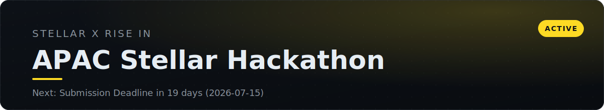
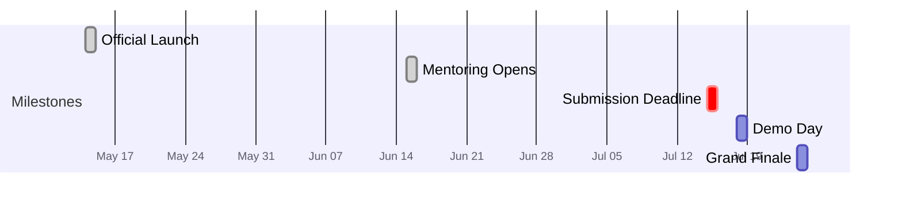

<!-- AUTO:START -->
<!-- Generated by scripts/render.py. Do not edit inside this block; edit competition.yml. -->

> **Submission Deadline** is overdue (was due 2026-07-15).

## Timeline

## Deliverables

- [ ] Project description
- [ ] Public GitHub repository
- [ ] Project README
- [ ] Demo video
- [ ] Pitch deck

## Resources

| Resource | Link |
| :--- | :--- |
| Registration | https://www.risein.com/programs/apac-stellar-hackathon |

Last updated 2026-07-19

<!-- AUTO:END -->

## Overview

The APAC Stellar Hackathon is the largest Stellar builder program in the region,
run by the Stellar Development Foundation with Rise In. It is fully online and
open to builders across APAC, with supporting events in Vietnam, Indonesia, and
the Philippines. The brief is narrow on purpose: build **real-world financial
applications** with genuine utility, not throwaway prototypes.

Our team is **registered, and both track and project are locked.** This repository
is our context hub and planning workspace: it holds the rules, the rubric we build
toward, our decisions, and links to everything we produce.

> **Project (locked):** **Patungan** — collective remittance + quadratic-funding matching
> on Stellar, filed under **Payment & Consumer Applications**. Tagline: *"gotong royong,
> on-chain."* Full spec in [`docs/prd.md`](docs/prd.md).

### Planning docs

| Doc | What it is |
| :--- | :--- |
| [`docs/prd.md`](docs/prd.md) | **The locked spec** — problem, mechanism, scope, timeline, risks, decisions |
| [`docs/pitch-deck-outline.md`](docs/pitch-deck-outline.md) | Slide-by-slide pitch outline (Indonesian round-one panel) |
| [`docs/quadratic-funding.md`](docs/quadratic-funding.md) | The QF mechanism deep-dive (the *why* behind the math) |
| [`docs/decision-handoff.md`](docs/decision-handoff.md) | Decision trail — what was explored and ruled out |
| [`docs/research/stellar-winner-patterns.md`](docs/research/stellar-winner-patterns.md) | Research: what past Stellar-hackathon winners had in common |
| [`prototype-arisan/`](prototype-arisan/) | Working Soroban escrow contract (2 passing tests) — reused for the QF engine |

## Our track

One team competes in exactly one track. Each track carries a **$20,000** prize.
**We are entering Payment & Consumer Applications** (locked) — remittances are a named
example of the track, giving Patungan a safe track-fit floor while the quadratic match
carries the innovation score. See [`docs/prd.md`](docs/prd.md) §4 for the reasoning.

| Track | Prize | What it rewards | Example builds |
| :--- | :--- | :--- | :--- |
| **Payment & Consumer Applications** | $20,000 | Simple, accessible payment and financial apps for everyday users | Remittances, merchant payments, payroll, consumer wallets |
| **Local Finance & Real World Access** | $20,000 | Connecting real-world assets and local financial systems to Stellar | RWA tokenization, anchor integrations, local-asset on/off ramps, savings products |
| **DeFi & Ecosystem Composability** | $20,000 | DeFi products and composable financial infrastructure | AMMs, lending, yield, DEX tooling, cross-chain and interoperability |

> **Locked:** Payment & Consumer Applications.

## What the judges reward

Build deliberately toward this rubric. Technical depth on Stellar and a real APAC
financial problem together carry **half the score**, so the project must
genuinely run on Stellar and solve a concrete problem for a clear user.

| Criterion | Weight | What scores well |
| :--- | :---: | :--- |
| Technical implementation & Stellar usage | 25% | It actually runs. Quality code and contracts, deep (not superficial) use of Stellar, basic security with proper auth |
| Real-world fit & use case | 25% | Solves a genuine APAC financial problem: remittances, payroll, merchant payments, savings, cross-border. A clear user |
| Innovation & differentiation | 20% | A novel approach that uses Stellar's real strengths (fast and cheap payments, built-in DEX, asset issuance). Not a clone |
| Viability & go-to-market | 10% | A credible path to real users, revenue, and sustainability. Market understanding |
| UX & accessibility | 5% | Usable by a non-crypto-native person. Smooth onboarding and wallet flow |
| Team & ability to continue | 5% | Team composition, commitment, and the likelihood of continuing past the hackathon |

## What to build

The organizers want user-facing financial applications that solve real problems.
Strong submissions tend to:

- Integrate with **local anchors** (the bridges between fiat and Stellar)
- Use **local assets** and give them real utility (earn, swap, disburse)
- Build with **composability** in mind: plug into existing wallets, DeFi
  protocols, and on/off ramps rather than reinventing them

Integration categories the organizers called out: on/off ramps (fiat access,
localized cash-out), DeFi and liquidity (lending, AMMs, DEX infrastructure),
payments and disbursements (consumer and merchant flows), and wallets and
identity (low-friction wallet integrations).

## Submission checklist

All five are required. The dashboard above tracks completion; notes on each:

1. **Project description** — what it does, the problem, the user, the Stellar usage.
2. **Public GitHub repository** — the code, public by the deadline.
3. **Project README** — setup, architecture, and a clear walkthrough.
4. **Demo video** — a short, working demonstration.
5. **Pitch deck** — the problem, solution, market, and team.

## Stellar stack and resources

Orientation for the build:

- **Soroban** — smart contracts on Stellar, written in **Rust**. Gas is paid in XLM.
- **Horizon API** — REST API to read accounts, assets, and transactions, and to submit transactions.
- **Anchors** — banks, exchanges, and transfer services that bridge fiat and Stellar.
- **Wallets** — Freighter, LOBSTR, Albedo for holding assets and signing.

| Resource | Link |
| :--- | :--- |
| Developer documentation | https://developers.stellar.org |
| Soroban smart contracts | https://developers.stellar.org/docs/build/smart-contracts |
| Build a dApp frontend | https://developers.stellar.org/docs/build/apps/dapp-frontend |
| Build a payment app | https://developers.stellar.org/docs/build/apps/example-application-tutorial |
| Build a wallet | https://developers.stellar.org/docs/build/apps/wallet |
| Horizon API | https://developers.stellar.org/docs/data/apis/horizon |
| Stellar anchors | https://stellar.org/learn/anchor-basics |
| Stellar tokens | https://developers.stellar.org/docs/tokens |
| Stellar Community Fund | https://communityfund.stellar.org |
| Pitch deck references 1 | https://canva.link/m9isikrjvmeirxf |
| Pitch deck references 2 | https://canva.link/gvjou3adgwds8h3 |

## Mentoring and finals

- **Mentoring** opened June 15. Early submissions get access to active mentoring
  sessions while continuing to build until the deadline.
- **Demo Day (July 18)** — projects pitch in a hybrid format. The top projects
  advance to the grand finale.
- **Grand Finale (July 24)** — the best teams from each country pitch live for
  five minutes, open to the Stellar community, partners, and investors.
- **After the hackathon** — weekly winner AMAs (Aug 1 to 24), then continued
  development support (Aug 25 to Sep 25). The Stellar Community Fund offers
  follow-on grants of up to **$150,000 in XLM** to take a validated project to
  launch.

## Project — Patungan

Full spec: [`docs/prd.md`](docs/prd.md). Summary:

- **Problem** — Indonesian migrant-worker (PMI/TKI) remittances are atomized private
  transfers; there is no trustworthy rail for the diaspora to *collectively* fund shared
  village projects, and institutional community-fund allocation carries a real trust gap.
- **Approach** — A sponsor (province / BP2MI / BRI, Dana Desa-style 3:1 match) seeds a
  matching pool; the diaspora chips in small amounts to village projects; a Soroban contract
  records every contribution on-chain and splits the pool by **breadth of support** via
  quadratic funding `(Σ√contribution)²`. Stellar's near-zero fees make on-chain
  micro-contributions viable — exactly what QF needs.
- **Architecture** — Soroban contract (Rust, the hero) + Freighter wallet + thin React
  frontend + a test IDR-stablecoin token on testnet. Anchor/SEP-24 is a narrated stretch.
- **Demo** — the reveal: one whale on Project A vs. 50 small donors on Project B → the match
  visibly flows to the crowd. _(Screenshots / recording / live link: TBD once built.)_

## Notes and decisions

A running log of decisions, rules to remember, mentor feedback, and open
questions.

- _2026-06-26_ — Tracker created. Registered; track and project pending.
- _2026-06-29_ — **Project + track locked:** Patungan (collective remittance + quadratic
  matching) under Payment & Consumer. Decisions pressure-tested via advisory council; see
  [`docs/prd.md`](docs/prd.md) §15.
- _2026-07-01_ — Council review: planning judged **complete enough to start building**;
  further planning is now procrastination. Repo reorganized (planning docs → `docs/`, stale
  "track not chosen" language removed). Next gate: run the `prototype-arisan/` toolchain +
  testnet round-trip to verify the "~60% reusable" foundation.
