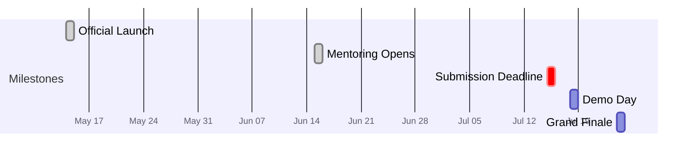

<!-- AUTO:START -->
<!-- Generated by scripts/render.py. Do not edit inside this block; edit competition.yml. -->

> Next milestone: **Submission Deadline**, 17 days remaining (2026-07-15).

## Timeline

## Deliverables

- [ ] Project description
- [ ] Public GitHub repository
- [ ] Project README
- [ ] Demo video
- [ ] Pitch deck

## Resources

| Resource | Link |
| :--- | :--- |
| Registration | https://www.risein.com/programs/apac-stellar-hackathon |

Last updated 2026-06-28

<!-- AUTO:END -->

## Overview

The APAC Stellar Hackathon is the largest Stellar builder program in the region,
run by the Stellar Development Foundation with Rise In. It is fully online and
open to builders across APAC, with supporting events in Vietnam, Indonesia, and
the Philippines. The brief is narrow on purpose: build **real-world financial
applications** with genuine utility, not throwaway prototypes.

Our team is **registered and scoping a project**. This repository is our context
hub and planning workspace. It holds the rules, the rubric we are building
toward, our track and project decisions, and links to everything we produce.

> **Open decisions:** track is not chosen, and the project concept is not locked.
> See [Choosing our track](#choosing-our-track) and [Project](#project).

## Choosing our track

One team competes in exactly one track. Each track carries a **$20,000** prize.

| Track | Prize | What it rewards | Example builds |
| :--- | :--- | :--- | :--- |
| **Payment & Consumer Applications** | $20,000 | Simple, accessible payment and financial apps for everyday users | Remittances, merchant payments, payroll, consumer wallets |
| **Local Finance & Real World Access** | $20,000 | Connecting real-world assets and local financial systems to Stellar | RWA tokenization, anchor integrations, local-asset on/off ramps, savings products |
| **DeFi & Ecosystem Composability** | $20,000 | DeFi products and composable financial infrastructure | AMMs, lending, yield, DEX tooling, cross-chain and interoperability |

> **Our track:** _to be decided._ Once chosen, set this section and confirm the
> tracker status.

## What the judges reward

Build deliberately toward this rubric. Technical depth on Stellar and a real APAC
financial problem together carry **half the score**, so the project must
genuinely run on Stellar and solve a concrete problem for a clear user.

| Criterion | Weight | What scores well |
| :--- | :---: | :--- |
| Technical implementation & Stellar usage | 25% | It actually runs. Quality code and contracts, deep (not superficial) use of Stellar, basic security with proper auth |
| Real-world fit & use case | 25% | Solves a genuine APAC financial problem: remittances, payroll, merchant payments, savings, cross-border. A clear user |
| Innovation & differentiation | 20% | A novel approach that uses Stellar's real strengths (fast and cheap payments, built-in DEX, asset issuance). Not a clone |
| Viability & go-to-market | 10% | A credible path to real users, revenue, and sustainability. Market understanding |
| UX & accessibility | 5% | Usable by a non-crypto-native person. Smooth onboarding and wallet flow |
| Team & ability to continue | 5% | Team composition, commitment, and the likelihood of continuing past the hackathon |

## What to build

The organizers want user-facing financial applications that solve real problems.
Strong submissions tend to:

- Integrate with **local anchors** (the bridges between fiat and Stellar)
- Use **local assets** and give them real utility (earn, swap, disburse)
- Build with **composability** in mind: plug into existing wallets, DeFi
  protocols, and on/off ramps rather than reinventing them

Integration categories the organizers called out: on/off ramps (fiat access,
localized cash-out), DeFi and liquidity (lending, AMMs, DEX infrastructure),
payments and disbursements (consumer and merchant flows), and wallets and
identity (low-friction wallet integrations).

## Submission checklist

All five are required. The dashboard above tracks completion; notes on each:

1. **Project description** — what it does, the problem, the user, the Stellar usage.
2. **Public GitHub repository** — the code, public by the deadline.
3. **Project README** — setup, architecture, and a clear walkthrough.
4. **Demo video** — a short, working demonstration.
5. **Pitch deck** — the problem, solution, market, and team.

## Stellar stack and resources

Orientation for the build:

- **Soroban** — smart contracts on Stellar, written in **Rust**. Gas is paid in XLM.
- **Horizon API** — REST API to read accounts, assets, and transactions, and to submit transactions.
- **Anchors** — banks, exchanges, and transfer services that bridge fiat and Stellar.
- **Wallets** — Freighter, LOBSTR, Albedo for holding assets and signing.

| Resource | Link |
| :--- | :--- |
| Developer documentation | https://developers.stellar.org |
| Soroban smart contracts | https://developers.stellar.org/docs/build/smart-contracts |
| Build a dApp frontend | https://developers.stellar.org/docs/build/apps/dapp-frontend |
| Build a payment app | https://developers.stellar.org/docs/build/apps/example-application-tutorial |
| Build a wallet | https://developers.stellar.org/docs/build/apps/wallet |
| Horizon API | https://developers.stellar.org/docs/data/apis/horizon |
| Stellar anchors | https://stellar.org/learn/anchor-basics |
| Stellar tokens | https://developers.stellar.org/docs/tokens |
| Stellar Community Fund | https://communityfund.stellar.org |
| Pitch deck references 1 | https://canva.link/m9isikrjvmeirxf |
| Pitch deck references 2 | https://canva.link/gvjou3adgwds8h3 |

## Mentoring and finals

- **Mentoring** opened June 15. Early submissions get access to active mentoring
  sessions while continuing to build until the deadline.
- **Demo Day (July 18)** — projects pitch in a hybrid format. The top projects
  advance to the grand finale.
- **Grand Finale (July 24)** — the best teams from each country pitch live for
  five minutes, open to the Stellar community, partners, and investors.
- **After the hackathon** — weekly winner AMAs (Aug 1 to 24), then continued
  development support (Aug 25 to Sep 25). The Stellar Community Fund offers
  follow-on grants of up to **$150,000 in XLM** to take a validated project to
  launch.

## Project

Locked once the track and concept are decided. Fill in:

- **Problem** — the specific APAC financial problem and who has it.
- **Approach** — the solution and why Stellar is the right rail.
- **Architecture** — Soroban contracts, anchors, wallets, and frontend.
- **Demo** — screenshots, a recording, and the live link.

## Notes and decisions

A running log of decisions, rules to remember, mentor feedback, and open
questions.

- _2026-06-26_ — Tracker created. Registered; track and project pending.
